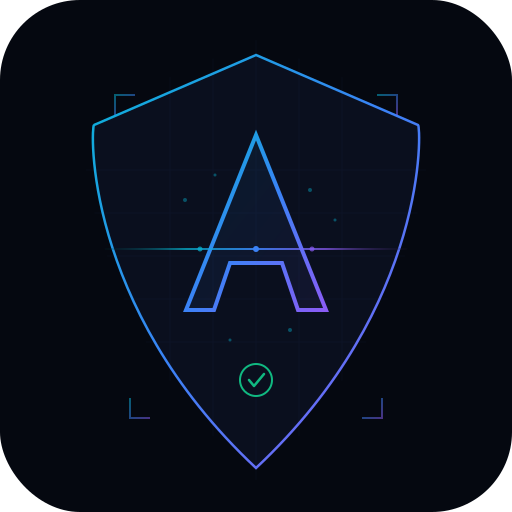

#  Arcanis — The Scanner That Proves It


**Find secrets. Score them 0-100. Free forever.**

Arcanis is a high-signal secret scanner that goes beyond pattern matching — it classifies targets, selects relevant modules, adapts to WAF pressure, and scores every finding with 6-factor confidence scoring. Built for bug bounty hunters who want signal, not noise.

```
$ python3 Arcanis_Community.py https://target.com --smart

[RECON] CT: 47 subs | DNS: 23 alive | High risk: 6
[SMART] api.target.com → cors, jwt, swagger
[SMART] admin.target.com → dom-xss, env, cors

[CRITICAL] Stripe Secret Key
  Confidence: 94/100  Status: Pattern matched
  → Upgrade to Pro for live verification + exploit paths
```

---

## Why Arcanis?

| Feature | Arcanis | TruffleHog | Gitleaks | GitGuardian |
|---------|---------|------------|----------|-------------|
| Confidence scoring | 6-factor (0-100) | ✗ | ✗ | Binary |
| Smart routing | Per-target modules | ✗ | ✗ | ✗ |
| WAF adaptation | Auto-stealth | ✗ | ✗ | ✗ |
| CORS + DOM XSS | 6+14 techniques | ✗ | ✗ | ✗ |
| False positive rate | < 5% | ~40% | ~35% | ~30% |

---

## Quick Start

```bash
# No installation. No key. Just run it.
python3 Arcanis_Community.py https://target.com --smart
```

### Requirements
- Python 3.8+
- `pip install requests` (only dependency)

### Recommended Command

```bash
python3 Arcanis_Community.py https://target.com \
  --smart \
  --db --diff \
  --depth 2 \
  -o results.json \
  --report html
```

---

## What's Included (Free)

- **90+ secret patterns** — API keys, tokens, credentials, cloud secrets
- **13 scan modules** — CORS, DOM XSS, JWT, open redirect, cloud perms, dep confusion, SSRF, IDOR, subdomain takeover
- **6-factor confidence scoring** — format, context, ownership, file path, entropy, pattern match → single 0-100 score
- **Smart mode** — classifies each subdomain (API, admin, auth, staging) and runs only relevant modules
- **Subdomain recon** — CT logs + DNS resolution + HTTP probe + risk scoring
- **WAF adaptive intelligence** — auto-detects Cloudflare/Akamai pressure, enters stealth mode, escalates to deep stealth
- **Differential scanning** — `--diff` shows new findings, resolved issues, new endpoints vs previous scan
- **SQLite persistence** — track findings across scans with `--db`
- **JSON + HTML output** — dark-themed HTML reports with finding deduplication

---

## Scan Modes

```bash
# Smart scan (recommended — selects modules per target)
python3 Arcanis_Community.py https://target.com --smart

# Individual modules
python3 Arcanis_Community.py https://target.com --cors-check --dom-xss --jwt-exploit

# Recon only (discover subdomains, don't scan)
python3 Arcanis_Community.py target.com --recon-only --db

# Stealth mode (WAF-heavy targets)
python3 Arcanis_Community.py https://target.com --smart -w 2 -r 2 --ua-rotate
```

---

## Sample Output

```
══════════════════════════════════════════════════════════════
  SMART SCAN PLAN — 23 targets
══════════════════════════════════════════════════════════════

  API SERVICE (3):
    [ 78] api.target.com
         modules: cors_check, jwt_exploit, probe_swagger, probe_graphql
    [ 65] graphql.target.com
         modules: probe_graphql, cors_check

  ADMIN PANEL (1):
    [ 82] admin.target.com
         modules: dom_xss, probe_env, cors_check

  AUTH SERVICE (2):
    [ 85] auth.target.com
         modules: jwt_exploit, cors_check, probe_env
```

---

## Pro Edition

The Community Edition finds and scores secrets. **Pro proves they're real.**

| Feature | Community (Free) | Pro |
|---------|-----------------|-----|
| Scan modules | ✓ All 13 | ✓ All 13 |
| Confidence scoring | ✓ 0-100 | ✓ 0-100 |
| Smart mode + recon | ✓ | ✓ |
| WAF adaptation | ✓ | ✓ |
| Targets per scan | 3 | Unlimited |
| **Live API verification** | — | **50+ verifiers** |
| **Exploit path suggestions** | — | **Per-finding** |
| **Attack chain mapping** | — | **With bounty tiers** |
| CVE lookup + Wayback | — | ✓ |
| PDF + SARIF output | — | ✓ |
| Batch scanning | — | ✓ |
| CI/CD integration | — | ✓ |

**→ [Get Arcanis Pro](https://arcanis.sh)**

---

## CLI Reference

| Flag | Description |
|------|-------------|
| `--smart` | Adaptive module selection per target (recommended) |
| `--db` | Enable SQLite persistence |
| `--diff` | Show delta vs previous scan |
| `--depth N` | Crawl depth (0 = target only) |
| `-w N` | Concurrent workers (default 5) |
| `-r N` | Rate limit (requests/sec, 0 = unlimited) |
| `--ua-rotate` | Rotate User-Agent per request |
| `-o FILE` | JSON output |
| `--report html` | Generate HTML report |
| `--cors-check` | CORS misconfiguration testing |
| `--dom-xss` | DOM XSS source/sink mapping |
| `--jwt-exploit` | JWT exploitation testing |
| `--open-redirect` | Open redirect testing |
| `--cloud-perms` | Cloud permission testing (S3/GCS/Firebase) |
| `--dep-confusion` | Dependency confusion checking |
| `--recon-only` | Subdomain recon without scanning |
| `--db-stats` | Show database statistics |

---

## Author

**Muhammad Muiz Zamri**

Built as a single Python file. 10,800+ lines. No frameworks. No cloud. No telemetry.

For authorized security testing only.

---

## Star History

If Arcanis helps you find something real, consider giving it a ⭐
