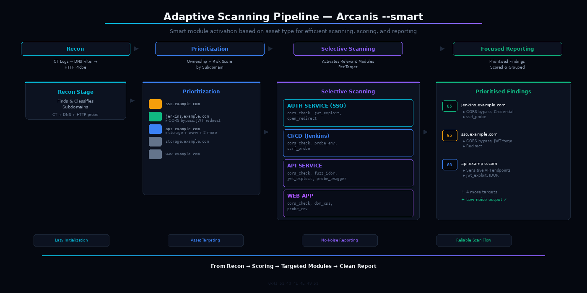
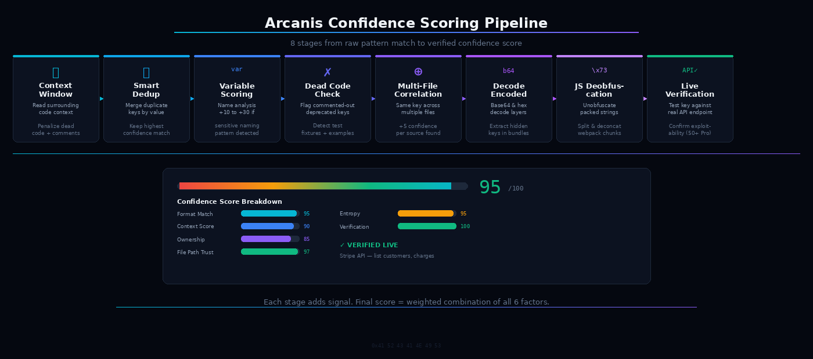

<p align="center">
  
</p>

# Arcanis

**Find secrets. Score them. Prove they're real.**
The only scanner built for bug bounty submissions — not triage.

[](https://github.com/arcanis-tools/Arcanis/releases)
[](#)

```
10,800+ lines · 13 modules · 90+ patterns · 6-factor scoring · WAF adaptive · Single file
```

### Features

- **Smart Mode** — classifies each subdomain (API, admin, auth, staging) and auto-selects modules. No manual flag picking.
- **6-Factor Confidence Scoring** — format, context, ownership, file path, entropy, pattern match → one 0-100 score per finding.
- **WAF Adaptive Intelligence** — detects Cloudflare/Akamai pressure, enters stealth, escalates to deep stealth, recovers conservatively.
- **13 Scan Modules** — CORS, DOM XSS, JWT, open redirect, cloud perms, dep confusion, SSRF, IDOR, subdomain takeover, and more.
- **Subdomain Recon** — CT logs + DNS resolution + HTTP probe + risk scoring from one command.
- **Differential Scanning** — `--diff` shows new findings, resolved issues, and new endpoints vs previous scan.
- **SQLite Persistence** — track findings and scan history across runs with `--db`.
- **Single File** — one Python file. No frameworks. No Docker. No cloud. No telemetry.

### Why hunters switch to Arcanis

- **Signal over noise:** 6-factor scoring eliminates false positives. < 5% FP rate vs 30-40% on other tools.
- **Adaptive scanning:** SmartRouter classifies each target and runs only relevant modules — no wasted time.
- **WAF-aware:** doesn't crash into firewalls. Adapts, backs off, recovers — completes the scan.
- **Submit-ready output:** every finding scored, contextualized, and ready for your report.

---

## Quick Start

```bash
# No installation. No signup. No key. Just run it.
pip install requests
python3 Arcanis_Community.py https://target.com --smart
```

```
[RECON] CT: 47 subs | DNS: 23 alive | High risk: 6
[SMART] api.target.com     → cors, jwt, swagger
[SMART] admin.target.com   → dom-xss, env, cors

[CRITICAL] Stripe Secret Key
  Confidence: 94/100   Status: Pattern matched
  Location: /js/app.bundle.js line 847
```

---

## Comparison

|  | Arcanis | TruffleHog | Gitleaks | GitGuardian |
|---|:---:|:---:|:---:|:---:|
| **Confidence scoring** | 6-factor (0-100) | ❌ | ❌ | Binary |
| **Smart routing** | Per-target | ❌ | ❌ | ❌ |
| **WAF adaptation** | Auto-stealth | ❌ | ❌ | ❌ |
| **CORS + DOM XSS** | 6+14 techniques | ❌ | ❌ | ❌ |
| **Exploit suggestions** | Per-finding | ❌ | ❌ | ❌ |
| **Differential scan** | `--diff` mode | ❌ | ❌ | ❌ |
| **False positive rate** | **< 5%** | ~40% | ~35% | ~30% |

---

## Architecture

[](smart-pipeline.png)

Every scan follows a 6-stage pipeline:

```
DISCOVER → RESOLVE → CLASSIFY → SCAN → VERIFY → SCORE
CT logs    DNS+HTTP  SmartRoute  13 mod   50+ API   0-100
```

| Stage | What Happens |
|-------|-------------|
| **Discover** | CT logs find every subdomain ever issued a certificate |
| **Resolve** | DNS + HTTP probe filters dead hosts |
| **Classify** | SmartRouter types each asset and selects modules |
| **Scan** | 90+ patterns + 13 modules, only where relevant |
| **Verify** | 50+ API verifiers call the real endpoint *(Pro)* |
| **Score** | 6-factor confidence → single 0-100 number |

[](scoring-pipeline.png)

---

## Modules

| Module | Description |
|--------|-------------|
| Secret Scanner | 90+ patterns — API keys, tokens, credentials, cloud secrets |
| CORS Checker | 6 misconfiguration techniques |
| DOM XSS | 14 sink types — source/sink mapping in JavaScript |
| JWT Exploit | Algorithm confusion, none bypass, key brute force |
| Open Redirect | Parameter-based redirect testing |
| Cloud Perms | S3, GCS, Firebase permission testing |
| Dep Confusion | npm registry check for internal packages |
| API Discovery | Swagger, GraphQL, gRPC probing |
| Subdomain Takeover | Dangling DNS / CNAME checks |
| SSRF Probe | Internal endpoint discovery |
| IDOR Fuzzer | Access control testing |
| Env Probe | .env file detection |
| Cloud Native | Multi-provider cloud scanning |

---

## WAF Intelligence

Arcanis doesn't crash into WAFs — it adapts.

```
Normal (5 workers, full speed)
  ↓ 403 blocks detected
Stealth (2 workers, 0.5 req/s, UA rotation)
  ↓ 12+ blocks persist
Deep Stealth (1 worker, max backoff)
  ↓ 90s cooldown
Conservative Recovery (33% workers if 50+ total blocks)
```

- 90-second cooldown prevents stealth↔resume oscillation
- Domain-level blocking skips domains with 5+ blocked URLs
- WAF Intelligence summary with block rate and recommendations

---

## Usage

**Recommended:**
```bash
python3 Arcanis_Community.py https://target.com --smart
```

**Full workflow:**
```bash
python3 Arcanis_Community.py https://target.com \
  --smart --db --diff --depth 2 \
  -o results.json --report html
```

**Individual modules:**
```bash
python3 Arcanis_Community.py https://target.com --cors-check --dom-xss
python3 Arcanis_Community.py https://target.com --jwt-exploit
python3 Arcanis_Community.py target.com --recon-only --db
```

**Stealth (WAF-heavy targets):**
```bash
python3 Arcanis_Community.py https://target.com --smart -w 2 -r 2 --ua-rotate
```

---

## CLI Reference

| Flag | Description |
|------|-------------|
| `--smart` | Adaptive module selection per target **(recommended)** |
| `--db` | Enable SQLite persistence |
| `--diff` | Show delta vs previous scan |
| `--depth N` | Crawl depth (0 = target only) |
| `-w N` | Concurrent workers (default 5) |
| `-r N` | Rate limit (requests/sec) |
| `--ua-rotate` | Rotate User-Agent per request |
| `-o FILE` | JSON output |
| `--report html` | Generate HTML report |
| `--cors-check` | CORS misconfiguration testing |
| `--dom-xss` | DOM XSS source/sink mapping |
| `--jwt-exploit` | JWT exploitation testing |
| `--open-redirect` | Open redirect testing |
| `--cloud-perms` | Cloud permission testing |
| `--dep-confusion` | Dependency confusion checking |
| `--recon-only` | Subdomain recon only |
| `--db-stats` | Database statistics |
| `--db-history` | Scan history |
| `--incremental` | Skip unchanged URLs |
| `-v` | Verbose output |

---

## Community vs Pro

Start free. Upgrade when you're ready.

| Feature | Community | Pro |
|---------|:---------:|:---:|
| 13 scan modules | ✅ | ✅ |
| 6-factor scoring | ✅ | ✅ |
| Smart mode + recon | ✅ | ✅ |
| WAF intelligence | ✅ | ✅ |
| JSON + HTML output | ✅ | ✅ |
| SQLite + diff | ✅ | ✅ |
| Targets per scan | 3 | **Unlimited** |
| **Live verification** | — | **50+ APIs** |
| **Exploit paths** | — | **Per-finding** |
| **Attack chains** | — | **Bounty tiers** |
| CVE + Wayback | — | ✅ |
| PDF + SARIF | — | ✅ |
| Batch scanning | — | ✅ |
| CI/CD | — | ✅ |

→ **[Get Arcanis Pro](mailto:arcanis.tools@gmail.com)**

---

## Requirements

- Python 3.8+
- `pip install requests`
- That's it. No Docker. No cloud. No API keys.

---

## License

Community Edition — free for personal, educational, and authorized security testing. See [LICENSE](LICENSE).

**For authorized security testing only.** Ensure you have written permission before scanning any target.

[Changelog](CHANGELOG.md) · [Security Policy](SECURITY.md)

---

<p align="center">
  <em>10,800+ lines. Single file. No frameworks. No cloud. No telemetry.</em>
</p>

<p align="center">
  If Arcanis helps you find something real, consider giving it a ⭐
</p>
