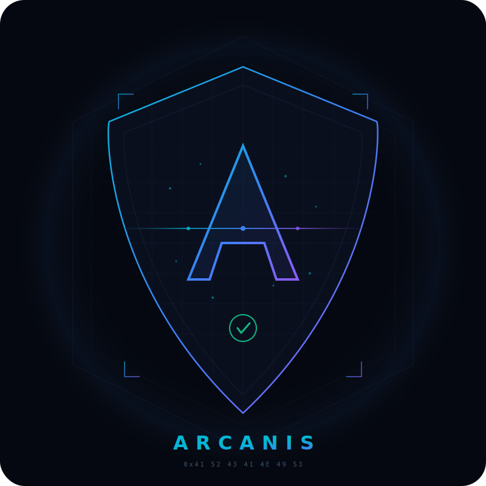

<p align="center">
  
</p>

<h1 align="center">Arcanis</h1>

<p align="center">
  <strong>Find secrets. Score them. Prove they're real.</strong><br>
  <em>Zero noise. Submit-ready. Built for bug bounty hunters.</em>
</p>

<p align="center">
  <a href="#"></a>
  <a href="#"></a>
  <a href="#"></a>
  <a href="#"></a>
  <a href="#"></a>
  <a href="#"></a>
</p>

<p align="center">
  <code>10,800+ lines</code> · <code>13 modules</code> · <code>90+ patterns</code> · <code>6-factor scoring</code> · <code>WAF adaptive</code> · <code>Single file</code>
</p>

---

## ⚡ Quick Start

```bash
# No installation. No signup. No key. Just run it.
pip install requests
python3 Arcanis_Community.py https://target.com --smart
```

```
[RECON] CT: 47 subs | DNS: 23 alive | High risk: 6
[SMART] api.target.com     → cors, jwt, swagger
[SMART] admin.target.com   → dom-xss, env, cors

[CRITICAL] Stripe Secret Key
  Confidence: 94/100   Status: Pattern matched
  Location: /js/app.bundle.js line 847
  → Upgrade to Pro for live verification + exploit paths
```

---

## ✨ Features

| | Feature | Description |
|---|---------|-------------|
| 🧠 | **Smart Mode** | Classifies each subdomain (API, admin, auth, staging) and auto-selects relevant modules. No manual flag picking. |
| 📊 | **6-Factor Scoring** | Format + context + ownership + file path + entropy + pattern match → single 0-100 confidence score. |
| 🛡️ | **WAF Adaptive Intelligence** | Auto-detects Cloudflare/Akamai pressure → stealth mode → deep stealth → conservative recovery. |
| 🔍 | **13 Scan Modules** | CORS, DOM XSS, JWT, open redirect, cloud perms, dep confusion, SSRF, IDOR, subdomain takeover, and more. |
| 🌐 | **Subdomain Recon** | CT logs + DNS resolution + HTTP probe + risk scoring. Hundreds of subdomains from one command. |
| 📈 | **Differential Scanning** | `--diff` shows new findings, resolved issues, new endpoints vs previous scan. |
| 💾 | **SQLite Persistence** | Track findings, scan history, and deltas across scans with `--db`. |
| ⚡ | **Single File** | One Python file. No frameworks. No Docker. No cloud. No telemetry. |

---

## 🏎️ Why Hunters Switch to Arcanis

| Feature | Arcanis | TruffleHog | Gitleaks | GitGuardian |
|---------|:-------:|:----------:|:--------:|:-----------:|
| Confidence scoring | ✅ 6-factor (0-100) | ❌ | ❌ | Binary |
| Smart routing | ✅ Per-target | ❌ | ❌ | ❌ |
| WAF adaptation | ✅ Auto-stealth | ❌ | ❌ | ❌ |
| CORS + DOM XSS | ✅ 6+14 techniques | ❌ | ❌ | ❌ |
| Exploit suggestions | ✅ Per-finding | ❌ | ❌ | ❌ |
| Differential scan | ✅ `--diff` mode | ❌ | ❌ | ❌ |
| False positive rate | ✅ **< 5%** | ~40% | ~35% | ~30% |

---

## 🧩 Architecture

Every scan follows a 6-stage intelligence pipeline:

```
┌─────────┐   ┌─────────┐   ┌──────────┐   ┌─────────┐   ┌────────┐   ┌───────┐
│ DISCOVER │──▶│ RESOLVE │──▶│ CLASSIFY │──▶│  SCAN   │──▶│ VERIFY │──▶│ SCORE │
│ CT logs  │   │ DNS+HTTP│   │SmartRoute│   │13 modules│  │ 50+ API│   │0-100  │
└─────────┘   └─────────┘   └──────────┘   └─────────┘   └────────┘   └───────┘
```

| Stage | What Happens |
|-------|-------------|
| **Discover** | CT logs find every subdomain ever issued a certificate |
| **Resolve** | DNS + HTTP probe filters dead hosts. Only alive targets proceed |
| **Classify** | SmartRouter types each asset — API, admin, auth, staging — and selects modules |
| **Scan** | 90+ patterns + 13 modules run only where relevant |
| **Verify** | 50+ API verifiers call the real endpoint *(Pro)* |
| **Score** | 6-factor confidence scoring → single 0-100 number |

---

## 📦 Modules

| Module | Description | Techniques |
|--------|-------------|------------|
| 🔐 Secret Scanner | API keys, tokens, credentials, cloud secrets | 90+ patterns |
| 🌐 CORS Checker | Misconfiguration detection | 6 techniques |
| 💉 DOM XSS | Source/sink mapping in JavaScript | 14 sink types |
| 🔑 JWT Exploit | Algorithm confusion, none bypass, key brute | Deep testing |
| 🔄 Open Redirect | Parameter-based redirect testing | Multi-vector |
| ☁️ Cloud Perms | S3/GCS/Firebase permission testing | Public access |
| 📦 Dep Confusion | npm registry check for internal packages | Registry probe |
| 🔍 API Discovery | Swagger, GraphQL, gRPC endpoint probing | Auto-detect |
| 🌍 Subdomain Takeover | Dangling DNS / CNAME checks | CNAME analysis |
| 📡 SSRF Probe | Internal endpoint discovery | Safe probing |
| 🔓 IDOR Fuzzer | Access control testing | ID enumeration |
| 🔍 Env Probe | .env file detection | Path bruteforce |
| ☁️ Cloud Native | Cloud-specific scanning | Multi-provider |

---

## 🛡️ WAF Intelligence

Arcanis doesn't crash into WAFs — it adapts:

```
Normal Mode (5 workers, full speed)
       │
       ▼  403 blocks detected
Stealth Mode (2 workers, 0.5 req/s, UA rotation)
       │
       ▼  12+ blocks in stealth
Deep Stealth (1 worker, 0.5 req/s, max backoff)
       │
       ▼  90s cooldown timer
Conservative Recovery (33% workers if 50+ total blocks)
```

- **90-second cooldown** prevents stealth↔resume oscillation
- **Domain-level blocking** skips domains with 5+ blocked URLs
- **WAF retry backoff**: 3^n + jitter (vs normal 2^n)
- **WAF Intelligence summary** in scan output with block rate and recommendations

---

## 💻 Usage

### Recommended (Smart Mode)
```bash
python3 Arcanis_Community.py https://target.com --smart
```

### Full Workflow
```bash
python3 Arcanis_Community.py https://target.com \
  --smart \
  --db --diff \
  --depth 2 \
  -o results.json \
  --report html
```

### Individual Modules
```bash
# CORS + DOM XSS only
python3 Arcanis_Community.py https://target.com --cors-check --dom-xss

# JWT exploitation
python3 Arcanis_Community.py https://target.com --jwt-exploit

# Recon only (discover subdomains, don't scan)
python3 Arcanis_Community.py target.com --recon-only --db
```

### Stealth Mode (WAF-heavy targets)
```bash
python3 Arcanis_Community.py https://target.com --smart -w 2 -r 2 --ua-rotate
```

---

## 📊 Sample Output

```
══════════════════════════════════════════════════════════════
  SMART SCAN PLAN — 23 targets
══════════════════════════════════════════════════════════════

  API SERVICE (3):
    [ 78] api.target.com
         modules: cors_check, jwt_exploit, probe_swagger, probe_graphql

  ADMIN PANEL (1):
    [ 82] admin.target.com
         modules: dom_xss, probe_env, cors_check

  AUTH SERVICE (2):
    [ 85] auth.target.com
         modules: jwt_exploit, cors_check, probe_env

══════════════════════════════════════════════════════════════
  FINDINGS — 3 confirmed
══════════════════════════════════════════════════════════════

  [CRITICAL] Stripe Secret Key          Confidence: 94/100
  [HIGH]     CORS Misconfiguration       Confidence: 87/100
  [MEDIUM]   JWT Algorithm Confusion     Confidence: 72/100
```

---

## 🔧 CLI Reference

| Flag | Description |
|------|-------------|
| `--smart` | Adaptive module selection per target **(recommended)** |
| `--db` | Enable SQLite persistence |
| `--diff` | Show delta vs previous scan |
| `--depth N` | Crawl depth (0 = target only) |
| `-w N` | Concurrent workers (default 5) |
| `-r N` | Rate limit (requests/sec, 0 = unlimited) |
| `--ua-rotate` | Rotate User-Agent per request |
| `-o FILE` | JSON output |
| `--report html` | Generate HTML report |
| `--cors-check` | CORS misconfiguration testing |
| `--dom-xss` | DOM XSS source/sink mapping |
| `--jwt-exploit` | JWT exploitation testing |
| `--open-redirect` | Open redirect testing |
| `--cloud-perms` | Cloud permission testing (S3/GCS/Firebase) |
| `--dep-confusion` | Dependency confusion checking |
| `--recon-only` | Subdomain recon without scanning |
| `--db-stats` | Show database statistics |
| `--db-history` | Show scan history |
| `--incremental` | Skip unchanged URLs |
| `-v` | Verbose output |

---

## 🆓 Community vs Pro

Start free. Upgrade when you're ready.

| Feature | Community (Free) | Pro |
|---------|:----------------:|:---:|
| All 13 scan modules | ✅ | ✅ |
| 6-factor scoring (0-100) | ✅ | ✅ |
| Smart mode + recon | ✅ | ✅ |
| WAF adaptive intelligence | ✅ | ✅ |
| JSON + HTML reports | ✅ | ✅ |
| SQLite persistence + diff | ✅ | ✅ |
| Targets per scan | 3 | **Unlimited** |
| **Live API verification** | — | **50+ verifiers** |
| **Exploit path suggestions** | — | **Per-finding** |
| **Attack chain mapping** | — | **With bounty tiers** |
| CVE lookup + Wayback | — | ✅ |
| PDF + SARIF output | — | ✅ |
| Batch scanning | — | ✅ |
| CI/CD integration | — | ✅ |

<p align="center">
  <strong>→ <a href="mailto:arcanis.tools@gmail.com">Get Arcanis Pro</a></strong>
</p>

---

## 📋 Requirements

- Python 3.8+
- `pip install requests` (only external dependency)
- No Docker. No cloud. No API keys needed.

---

## 📝 Changelog

See [CHANGELOG.md](CHANGELOG.md) for version history.

---

## 🔒 Security

See [SECURITY.md](SECURITY.md) for responsible disclosure policy.

**For authorized security testing only.** Ensure you have written permission before scanning any target.

---

## 📜 License

Community Edition — free for personal, educational, and authorized security testing. See [LICENSE](LICENSE).

---

<p align="center">
  <strong>Built by Muhammad Muiz Zamri</strong><br>
  <em>10,800+ lines. Single file. No frameworks. No cloud. No telemetry.</em>
</p>

<p align="center">
  If Arcanis helps you find something real, consider giving it a ⭐
</p>
